# Kernel

It tells hardware what to do.  
It tells CPU what process to run.  
It decides where in memory the data is stored.  
It talks to devices like keyboard.

This schemantic is somewhat misleading as kernel itself lives in memory.

The kernel provides instructions that the CPU executes.  
And there are ways to display letters on the screen.  
And there are also ways to receive input.

## Installing the tools that we need for development (build tools, bootloader and an emulator):  
> sudo apt install 
    build-essential
    binutils
    nasm
    bochs
    bochs-sdl
    grub-pc-bin
    grub-common
    xorriso
    vgabios

### Install the qemu emulator
> sudo apt install qemu-system

## How to use these tools for building the kernel?  
- The kernel or any OS is started by going through a boot process.  
- Ater the computer is turned ON the computer jumps to specific memory location.  
- And in that location lives the BIOS.  
- The BIOS runs some tests and looks for a bootloader and transfers control to it.  
- And the bootloader then looks for our kernel, loads it into memory and jumps to its entry point.  


- To run a kernel we have to provide a bootloader and a kernel binary.  
- We use GRUB as a bootloader. So we then pack GRUB and our kernel into a bootable ISO file.  
- After that we can use the emulator to boot from this ISO file.  
- Our installed emulator is Bochs.  

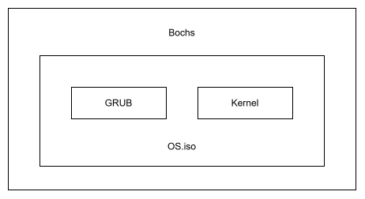

## Memory layout of the kernel binary

### kernel.elf

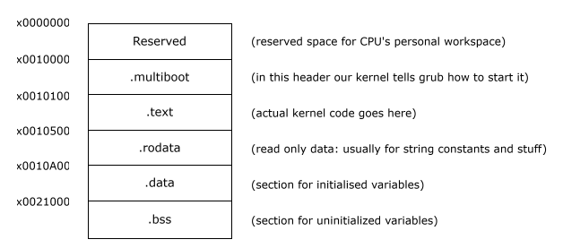

### Compile the assembly file
```
nasm -f elf32 loader.s -o loader.o
```

### Use linker to build kernel binary
```
ld -T link.ld -melf_i386 loader.o -o kernel.elf
```

### Use grub to build the ISO file
```
mv kernel.elf iso/boot
grub-mkrescue -o ritamOS.iso iso -d /usr/lib/grub/i386-pc
```

### Run bootable ISO in the bochs emulator
```
bochs -f bochsrc.txt
```

### Run bootable ISO in the qemu emulator
```
qemu-system-i386 -cdrom ritamOS.iso
```

### Start qemu and wait for GDB
```
qemu-system-i386 -cdrom ritamOS.iso -s -S
```

- -S: freezes the CPU immediately at startup.  
      Qemu starts, but does not execute the first instruction until a debugger tells it to continue.  
- -s: enables qemu's built-in GDB server on TCP port 1234. It is equivalent to:
```
-gdb tcp::1234
```

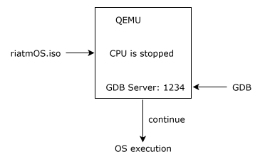

Connect GDB from another terminal:
```
cd iso/boot
gdb kernel.elf
```

Inside GDB:
```
target remote :1234      # Connect to qemu
break gdt_init           # Set breakpoint at gdt_init function
break *0x100000          # Break at address
continue                 # Continue execution
stepi 100                # Execute 100 instructions
x/10i $eip               # Show next 10 instructions
info registers           # GDB: show CPU registers
monitor info registers   # QEMU: show CPU registers
```
This is useful for debugging RitamOS kernel at the instruction/register level.

## Setup the kernel stack

### .bss

- Reserve some memory in .bss (say 4KB).
- To initialize the stack, we only need to setup the stack pointer to the beginning of the reserved region.
- Use push instructions to push values on the stack.
- The stack pointer then increases automatically.       *(push dword 0x00000008) (doubleword = 4 bytes)*
- When we pop values, the stack pointer decreases automatically.        *(pop eax)*


### Why we need the stack for function calls ?
**_cdecl calling convention_** (Function calling convention)  

```
test_func(arg1, arg2, arg3);
```
> To call a function with 3 arguments (4 byte each)   
  The convention requires that we push each argument into the stack in opposite order.  
  After we push the arguments in the stack, we call the function.  
  And the call then also pushes return address on the stack and maybe some other stuff.

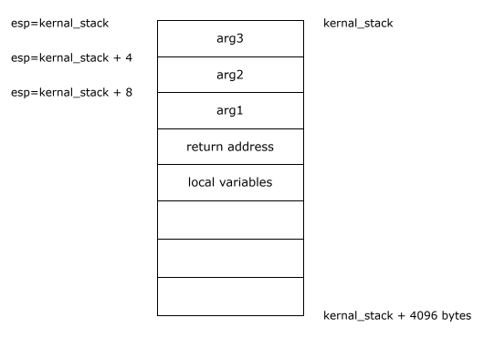

## Framebuffer

Framebuffer is a memory region within the reserved section in kernal memory.  
It is located at this fixed address and has a size of about 32 kilobytes.  
To display something on the screen, we can write entries with a specific structure into this region.  

Text-based framebuffer that can only display text.  
The idea behind the text-based framebuffer is to divide the screen into 80 columns and 25 rows.  
Each entry in the framebuffer fills one of these cells with a letter.  
Each entry has a size of 2 bytes (16 bits).  

Example: letter 'X' in green with a white background

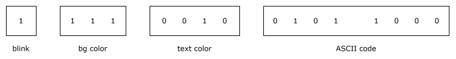

Depending on the mode setup, attribute bit 7 may be either the blink bit  
or the fourth background color bit (which allows all 16 colors to be used as background colors).  
Bit 3 is the bright bit, which turns, for example, blue into light blue.  
For the background color, this bit is repurposed as the blink bit in Bochs.

> Flickering issue in Bochs  
Default Behavior (Blinking Enabled): Bits 0–2 determine the background color,  
and Bit 7 toggles blinking. High-intensity backgrounds are impossible.

These entries are continuously read by the hardware and transformed on the screen.  
Pixel-mode framebuffer is more versatile.

## Cursor and Scrolling

To move the cursor or scroll up and down we send commands to the CRT controller.  
The CRT controller is a chip which manages how text is rendered on the screen.  
It has several registers to control the cursor position, the cursor shape or the display offset.  

To access these registers we have two ports: the command port and the data port.  
The command port takes the index of the register that we want to access.  
The data port takes the value we want to write to that register.  
And to do that we can use CPU's out instruction.  

Suppose, if we want to move the cursor in row 2 and column 5.
The cursor offset would be 0x00A5 (2 * 80 + 5 = 165).  

The data port is only 8 bits wide and we need to write 16 bits, we have to split the value and send the high and low bytes separately.
We first send the index of the cursor postion high byte register to the command port and then the high byte value to the data port.  
The controller then automatically writes values to the register.

> out 0x3D4, 0x0E  
  out 0x3D5, 0x00  
  out 0x3D4, 0x0F  
  out 0x3D5, 0xA5  

Suppose we want to scroll 3 lines, the offset would be 0x00F0 (2 * 80 = 160)
> out 0x3D4, 0x0C  
  out 0x3D5, 0x00  
  out 0x3D4, 0x0D  
  out 0x3D5, 0xA0  

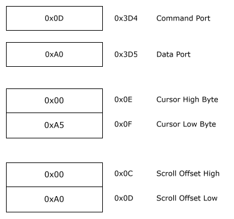

The cursor styling works exactly like moving the cursor except that it uses different commands.  
Register 0x0A controls cursor start scanline and cursor disable bit.  

The layout is:


> Bit 5: Cursor disable bit  
    0 = cursor enabled  
    1 = cursor disabled

Since VGA characters are typically 16 scanlines high.  
Writing 0x0C (12) means start drawing from scanline 12. Only bottom few lines are drawn.  
Result: A thin underline cursor.

## Serial Communication

At the most basic level, serial communication is a way to transfer data from one location to another.  
Data is sent from a Transmitter (Tx) and it is received by a Receiver (Rx).  
The transmitter and the receiver is connected by a line.  
Sending data means applying a voltage on the transmitter side for a given amount of time and then measuring them on the reciver side.  

The word serial in serial communication means that we send each bit separately.  
If we send a byte (8 bits), we send it in a series over one line.  
Serial communication is not the only way of transferring data from A to B.  
In parallel communication, we send all the bits of a byte simultaneously.  

### UART

UART provides rules on how to communicate.  

UART Connection:

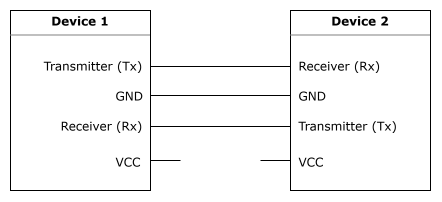

GND - Both lines share a common ground. This serves as a way to provide a voltage reference point so that the signal levels can be interpreted correctly.  
VCC - It carries a supply voltage which if used wrong, can fry the device.

To send data, we apply high voltage over some time and low voltage over some time.  

High voltage means 1  
Low voltage means 0


Each high voltage or low voltage could contain several data points.  
A fixed period of time is decided that tells us how long a signal has to last to count as a single data point.  

In UART this time length is defined as baudrate.  
Baudrate is defined as number of symbols (data points) transmitted in one second.  

> Baudrate = Symbols / Second

If baudrate = 8 Bd (8 signals per second)  
and also if the whole transmission lasted for 1 second.

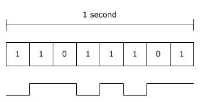

The baudrate should be same for the sender (Tx) and the receiver (Rx).  
Common baudrates: 4800, 9600, 19200, 57600, 115200.

Setting up the serial port is quite similar to how cursor style is changed.  

Constants from the base addresses of COM1 and COM2.
This can be referenced from [osdev.org](https://wiki.osdev.org/Serial_Ports)

| Base Address | Serial Port |
|--------------|-------------|
| `0x3F8` | COM1 |
| `0x2F8` | COM2 |

Explicit addresses for COM1:

| I/O Port | Register |
|---------|----------|
| `0x3F8` | Receive / Transmit Buffer |
| `0x3F9` | Interrupt Enable Register |
| `0x3FA` | FIFO Control Register |
| `0x3FB` | Line Control Register |
| `0x3FC` | Modem Control Register |
| `0x3FD` | Line Status Register |
| `0x3FE` | Modem Status Register |
| `0x3FF` | Scratch Register |

All of these above registers can be used to control different aspects of the serial connection.

### Disable Interrupts

Enabling interrupts would mean that UART controller interrupts the CPU each time when its buffer is full.  
Since interrupt handling is not implemented yet, we can use polling approach.  
We have to proactively ask UART controller about its state.  
To deactivate interrupts, Interrupt enable register needs to be set as 0.

### Set Baud Rate

We do not set the baud rate itself but the divisor of the controller.  
To set the divisor to the controller:
- Set the most significant bit of the Line Control Register. This is the DLAB bit, and allows access to the divisor registers (data register and interrupt register).
- Send the least significant byte of the divisor value to [PORT + 0], i.e. data register.
- Send the most significant byte of the divisor value to [PORT + 1], i.e. interrupt register.
- Clear the most significant bit of the Line Control Register.

> Baudrate = 115200 / divisor

### UART Frame

In UART, data is sent in specifically defined chunks.  These chunks are called frames.  
Each frame consists of the data that is sent and 3 or 4 additional control bits.

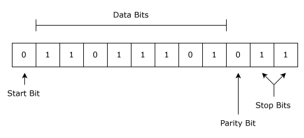

Depending on the config, the data is between 5 to 9 bits long.  
The remaining config bits are a start bit that signals the receiver by a falling edge, that the data is coming in.  
A stop bit that signals the end of the frame. Depending on the config there can also be two stop bits.  
And finally an optional parity bit that serves as a kind of simple checksum.

We choose a very common frame layout 8N1. It has 8 data bits, one start bit, one stop bit and no parity.  
8N1 is by far the most common serial format and is the default used by most operating systems, bootloaders, terminal emulators, and UART debugging output.  
To configure this, line control register needs to be set to a specific binary value of 00000011 (0x03).  
Refer to [Baud_Rate](https://wiki.osdev.org/Serial_Ports#Baud_Rate) for calculation.

**Line Control Register:**  
The Line Control register sets the general connection parameters.

| Bit 7   | Bit 6            | Bit 5-3     |  Bit 2    |  Bit 1-0  |
|:-------:|:----------------:|:-----------:|:---------:|:---------:|
| DLAB    | Break Enable Bit | Pairty Bits | Stop Bits | Data Bits |

So 00000011 (0x03) sets:  
```ascii
Bit 1-0 = 1     Character length is 8 bits  
Bit 2   = 1     Use 1 Stop Bit  
Bit 5-3 = 0     Parity is disabled  
Bit 7   = 0     The Divisor Latch Access Bit (DLAB) is cleared.
```

**FIFO Control Register:**  
This register is for controlling FIFO buffer.

| Bit 7-6                 | Bit 5-4  | Bit 3    |  Bit 2              |  Bit 1             | Bit 0       |
|:-----------------------:|:--------:|:--------:|:-------------------:|:------------------:|:-----------:|
| Interrupt Trigger Level | Reserved | DMA Mode | Clear Transmit FIFO | Clear Receive FIFO | Enable FIFO |

So 11000111 (0xC7) sets:
```ascii
Bit 0    = 1    Enable FIFO  
Bit 1    = 1    Clear receive (Rx) FIFO  
Bit 2    = 1    Clear transmit (Tx) FIFO  
Bits 7-6 = 11   Interrupt when FIFO has 14 bytes
```

**Modem Control Register:**  

| Bit 4                     | Bit 3               | Bit 2 | Bit 1 |  Bit 0        |
|:-------------------------:|:-------------------:|:-----:|:-----:|:-------------:|
| DTR (Data Terminal Ready) | RTS (Ready to Send) | OUT1  | OUT2  | Loopback Mode |

So 00000011 (0x03) means:  
```ascii
DTR = ON
RTS = ON
```

These are classic RS-232 modem control signals.
```ascii
Computer ---------------- Modem

DTR ---> "I'm powered on"
RTS ---> "I'm ready to transmit"
CTS <--- "Go ahead"
```

**Line status register:**  
To output something, we first have to ask if the connection is ready to send data.  
Line status register is used to do it. This register contains various pieces of information about connection status.  
To get this status, we have to use the inb instruction to filter out bit 5.  
Bit 5 is called THRE (Transmit Holding Register Empty). It tells whether the transmission buffer is empty.  
If bit 5 = 1, it means that the UART is ready to accept another byte.

To send data from another machine to the kernel, we first check whether the connection is ready to read data.  
Bit 1 is called DR (Data Ready). It tells that a byte is waiting in the receive buffer.  
Reading this register does two things:  
- Returns the received byte.  
- Removes it from the UART's receive buffer.

Polling is a technique where the CPU repeatedly checks a hardware device to see if it is ready, instead of the device notifying the CPU.  
Imagine no one sends any data for 10 seconds.  
During those 10 seconds, the CPU keeps checking the status of Line Status Reegister continuously.  
This wastes CPU cycles.

#### Put serial output into a file
```
qemu-system-i386 -cdrom ritamOS.iso -serial file:com1.out
```

#### Read serial input from terminal or put serial output into terminal
```
qemu-system-i386 -cdrom ritamOS.iso -serial stdio
``` 
This command is bidirectional.

## Memory Protection

Whenever a process is waiting for input and it has nothing to do. The process switches to another process instead of being idle.  
To switch between processes is to give each process full access of memory.  
If a process has idle time, its state is saved into memory and another process is loaded.  

| Operation        | Real Time  | Scaled (1 ns = 1 sec) |
| ---------------- | ---------- | --------------------- |
| CPU instruction  | 0.3 ns     | 0.3 second            |
| L1 cache read    | 1 ns       | 1 second              |
| L2 cache read    | 10 ns      | 10 seconds            |
| Main memory read | 100 ns     | 1 minute 40 seconds   |
| SSD read         | 100 μs     | 1 day                 |
| HDD seek         | 5 ms       | ~2 months             |
| Cross-region network RTT | 80 ms | ~2.5 years         |

However, saving a program state on disk is very slow.  
So, it will be way better to leave the process in the memory while switching between them.

This introduced another set of problems. One particular issue is of memory protection.
We certainly do not want a process to read and write into another process's memory space.

The solution at that time was base and bounds.  

### Base and Bounds

In base and bounds, there are two CPU registers: base register and bounds register.
Both these registers together define the memory region.

base: start of the process memory
bound: size of the process memory

Physical Memory:

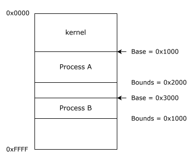

Each process thinks it starts at address 0.  
The MMU (Memory Management Unit) of CPU adds base to produce the real physical address.  


The program looks like below in memory:


There is some unused space between the heap and the stack for the program to grow.  
But with base and bounds we have to store the entire program in one piece.  
So, we have to reserve this space, even if we don't store anyting there.  
It causes memory wastage.

### Segmentation

Segmentation is a memory management technique where memory is divided into variable-sized chunks called segments.  
Each segment is defined by a base address and a limit (size).

Segmentation on x86 is base-and-bounds, just applied per-segment instead of per-process.  
The CPU has several segment registers.

| Register | Purpose                 |
| -------- | ----------------------- |
| CS       | Code Segment            |
| DS       | Data Segment            |
| SS       | Stack Segment           |
| ES       | Extra Segment           |
| FS       | General-purpose segment |
| GS       | General-purpose segment |

The term **segmentation fault** comes from an illegal memory access on a segmented machine.  
This term still persists even on machines where no segmentation is used.

#### Physical Memory

The memory that CPU addresses on its bus is called physical memory.   
The physical memory is organized as a sequence of bytes.  
Each byte is assigned a unique address called the physical address.  
The physical address space in a 32-bit system ranges from 0 to (2^32 - 1) bytes.

### Global Descriptor Table

The GDT contains the description of the segments that we want to use.  
Each entry within GDT is called segment descriptor.  
The segment descriptor defines base address, size of the segment, access rights and flags.  
The segment descriptor is 8 bytes long. x86 is little endian.  
Reference Document: [Combined Volume Set of Intel® 64 and IA-32 Architectures](https://www.intel.com/content/www/us/en/developer/articles/technical/intel-sdm.html#inpage-nav-1)

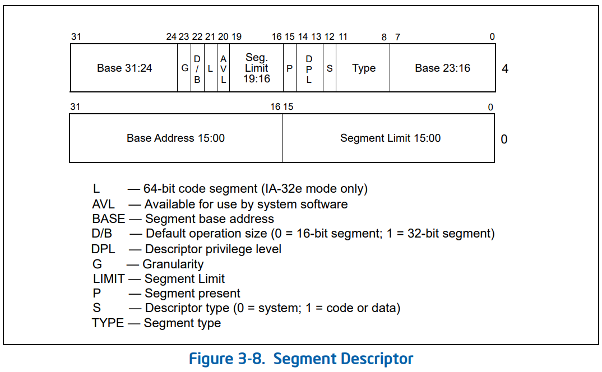

#### 1. Base Address

Base Address is 32 bits long but Intel stores it in three pieces:
```ascii
Base =
Base31:24
Base23:16
Base15:0

If segment starts at 1MB, Base = 0x00100000
Base31:24 = 0x00
Base23:16 = 0x10
Base15:0  = 0x0000
```

#### 2. Segment Limit

The limit is the maximum offset allowed within the segment. It is 20 bits long.
```ascii
Limit =
Limit19:16
Limit15:0
```

#### 3. Access Byte

The access byte determines what kind of segment this is.

#### P (Present)

If the CPU accesses a segment with P = 0, it raises a fault.
```ascii
1 = Segment exists
0 = Not present
```

#### DPL (Descriptor Privilege Level)
```ascii
00 = Ring 0
01 = Ring 1
10 = Ring 2
11 = Ring 3
```
Most operating systems only use
Ring 0
Ring 3

#### S (Descriptor Type)
```ascii
0 = System descriptor
1 = Code/Data descriptor
```
Examples of system descriptors: TSS, LDT, Call Gate  
For ordinary code and data segments: S = 1

#### Type

The Type field is 4 bits wide (bits 3–0 of the Access Byte).  
Its meaning depends on whether the descriptor is a code segment or a data segment (S = 1).
Data segments are readable and code segments are executable.

Data Segment Types:
| Binary | Hex   | Expand Down | Writable | Accessed | Description                       |
| ------ | ----- | ----------- | -------- | -------- | --------------------------------- |
| `0000` | `0x0` | No          | No       | No       | Read-only                         |
| `0001` | `0x1` | No          | No       | Yes      | Read-only, accessed               |
| `0010` | `0x2` | No          | Yes      | No       | **Read/Write**                    |
| `0011` | `0x3` | No          | Yes      | Yes      | Read/Write, accessed              |
| `0100` | `0x4` | Yes         | No       | No       | Expand-down, read-only            |
| `0101` | `0x5` | Yes         | No       | Yes      | Expand-down, read-only, accessed  |
| `0110` | `0x6` | Yes         | Yes      | No       | Expand-down, read/write           |
| `0111` | `0x7` | Yes         | Yes      | Yes      | Expand-down, read/write, accessed |

Code Segment Types:
| Binary | Hex   | Conforming | Readable | Accessed | Description                        |
| ------ | ----- | ---------- | -------- | -------- | ---------------------------------- |
| `1000` | `0x8` | No         | No       | No       | Execute-only                       |
| `1001` | `0x9` | No         | No       | Yes      | Execute-only, accessed             |
| `1010` | `0xA` | No         | Yes      | No       | **Execute/Read**                   |
| `1011` | `0xB` | No         | Yes      | Yes      | Execute/Read, accessed             |
| `1100` | `0xC` | Yes        | No       | No       | Conforming, execute-only           |
| `1101` | `0xD` | Yes        | No       | Yes      | Conforming, execute-only, accessed |
| `1110` | `0xE` | Yes        | Yes      | No       | Conforming, execute/read           |
| `1111` | `0xF` | Yes        | Yes      | Yes      | Conforming, execute/read, accessed |


#### 4. Flags

#### G (Granularity)

If G = 0, the segment size can range from 1 byte to 1 MByte, in byte increments.
Limit is measured in bytes.
```ascii
Limit = 1000 means 1000 bytes
```

If G = 1, the segment size can range from 4 KByte to 4 GByte, in 4KByte increments.
Limit is measured in 4 KB pages.
```ascii
Limit = 0xFFFFF means 0xFFFFF × 4096
≈ 4 GB
```

This is why almost every OS sets G = 1.

#### D/B

For code segments:
```ascii
0 = 16-bit code
1 = 32-bit code
```

For stack/data segments:
```ascii
0 = 16-bit stack
1 = 32-bit stack
```

For our 32-bit OS:
D = 1

#### L

64-bit code segment  
Only used in x86-64.  
For our 32-bit OS: L = 0

#### AVL

Intel leaves this bit for the operating system.  
Most kernels simply set it to 0.    

### Endianness

Endianness describes the byte order in which multi-byte values are stored in memory.  
There are two primary types of endianness:  
Little-endian: The least significant byte (LSB) is stored first (lowest memory address).  
Big-endian: The most significant byte (MSB) is stored first (lowest memory address).

Common Little Endian Processors:
- Intel x86/x64 processors
- ARM (default mode)
- AMD architectures

Common Big Endian Processors:
- IBM PowerPC
- Motorola 68K
- SPARC architectures
- Network Byte Order (TCP/IP)
